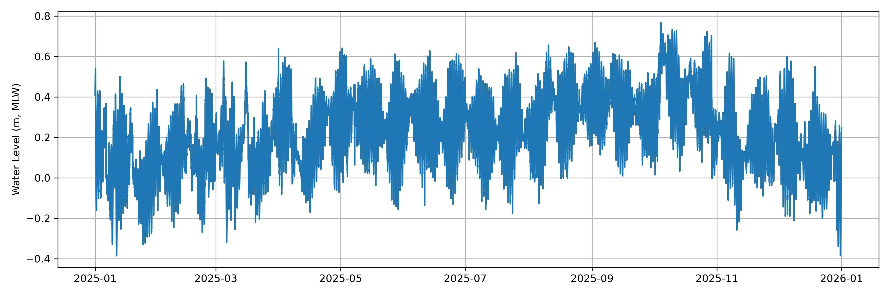

# NOAA Tides & Currents 6-Minute Data Auto Retrieval

A lightweight Python toolkit for downloading **NOAA Tides & Currents water-level data at 6-minute intervals** using the NOAA CO-OPS API, then saving the results as a CSV file and generating a quick-look plot.

This repository is designed for:
- coastal oceanography
- climate and sea-level research
- storm surge screening
- tidal variability studies
- environmental data preprocessing
- reproducible station-based observational workflows

---

## Overview

This project provides a simple and practical workflow to retrieve NOAA CO-OPS water-level observations for a chosen station and time window.

The code:

1. builds a NOAA API request URL,
2. splits long date ranges into monthly chunks,
3. downloads water-level data chunk by chunk,
4. merges all monthly results into one `pandas.DataFrame`,
5. saves the result to CSV,
6. and generates a figure for rapid inspection.

The repository currently includes:

- `LIB_NOAATideCurrentsDataDownload.py` — reusable Python library functions
- `NOAA_TideCurrents_DataRetrievals_example.py` — example script
- `NOAA_TideCurrents_DataRetrievals_example.ipynb` — Jupyter notebook workflow
- `NOAA8761724_dt_from_20250101_to_20251231_datum_MLW.csv` — example output dataset
- `NOAA8761724_dt_from_20250101_to_20251231_datum_MLW.png` — example output plot

---

## Included sample figure

The repository includes a sample time-series figure generated from NOAA station **8761724 (Grand Isle)** for the period **2025-01-01 to 2025-12-31** using the **MLW** datum.



**Figure 1.** Example NOAA 6-minute water-level time series for station `8761724` from `2025-01-01` to `2025-12-31`, referenced to datum `MLW` and plotted in metric units.

---

## Repository structure

```text
.
├── LIB_NOAATideCurrentsDataDownload.py
├── NOAA_TideCurrents_DataRetrievals_example.py
├── NOAA_TideCurrents_DataRetrievals_example.ipynb
├── NOAA8761724_dt_from_20250101_to_20251231_datum_MLW.csv
├── NOAA8761724_dt_from_20250101_to_20251231_datum_MLW.png
├── LICENSE
└── README.md
```

---

## Requirements

This project uses Python and a few standard scientific packages.

### Python packages
- `pandas`
- `matplotlib`

No complex dependency stack is required for the core workflow.

Install dependencies with:

```bash
pip install pandas matplotlib
```

If you also want notebook support:

```bash
pip install notebook jupyter
```

---

## NOAA data source

This repository downloads data from the **NOAA Tides & Currents CO-OPS API** for the `water_level` product.

The API request is built with parameters such as:
- station ID
- begin date
- end date
- datum
- time zone
- units
- output format

This project currently focuses on **water-level retrieval** and is especially useful when users want:
- long time windows
- easy CSV export
- direct `pandas` integration
- simple visualization

---

## Core workflow

### Step 1 — Define user inputs
You specify:
- NOAA station ID
- start date
- end date
- datum
- units
- time zone

### Step 2 — Split the request into monthly chunks
Long date ranges are divided into monthly windows to make the download process more robust and easier to debug.

### Step 3 — Download NOAA data
Each monthly chunk is downloaded separately using the NOAA API.

### Step 4 — Merge and clean
All monthly dataframes are concatenated, sorted by time, and cleaned for downstream analysis.

### Step 5 — Save and plot
The example script writes the merged dataframe to CSV and generates a PNG figure.

---

## Main functions

## `genNOAALink(...)`
Builds a NOAA CO-OPS API URL for a specific station, date range, datum, time zone, units, and output format.

## `get_monthly_periods(...)`
Splits a `YYYYMMDD` start/end date pair into month-by-month date windows.

## `downloadNOAA_WSE(...)`
Downloads all monthly windows, merges them into a single dataframe, cleans the result, and returns a time-indexed `pandas.DataFrame`.

---

## Quick start

### Example script

Run:

```bash
python NOAA_TideCurrents_DataRetrievals_example.py
```

This will:
- download the configured NOAA dataset,
- save a CSV file,
- create a PNG plot.

---

## Example Python usage

```python
from LIB_NOAATideCurrentsDataDownload import downloadNOAA_WSE

station = "8761724"
begin_date = "20250101"
end_date = "20251231"

df = downloadNOAA_WSE(
    NOAAstationNo=station,
    NOAAbegin_date=begin_date,
    NOAAend_date=end_date,
    datum="MLW",
    timezone="GMT",
    unit="metric",
    format="csv",
    debugFlag=True,
)

print(df.head())
print(df.tail())
print(df.columns)
```

---

## Example output

For the included sample run:

- **Station:** `8761724`
- **Station label in script:** Grand Isle
- **Date range:** `2025-01-01` to `2025-12-31`
- **Datum:** `MLW`
- **Units:** `metric`
- **Time zone:** `GMT`

The included notebook output indicates approximately:

- **87,600 rows**
- **8 data columns** plus datetime index

This is consistent with a full year of 6-minute observations.

---

## Output data structure

The downloaded dataframe typically includes NOAA-returned columns such as:

- `Date Time`
- `Water Level`
- `Sigma`
- `O or I (for verified)`
- `F`
- `R`
- `L`
- `Quality`

The workflow also adds a parsed datetime index for direct time-series analysis.

---

## Why monthly chunking is useful

NOAA requests over long time spans are often more reliable when split into smaller windows.

Benefits of monthly chunking:
- easier error tracing
- reduced risk of losing an entire long request
- cleaner recovery when one chunk fails
- more scalable for long research periods

---

## Suggested scientific use cases

This tool is useful for:
- tidal signal inspection
- sea-level variability analysis
- storm-event water-level screening
- model validation
- observational forcing preparation
- anomaly detection
- time-series QC workflows
- coastal hazard assessments

Because the output is a `pandas.DataFrame`, it integrates naturally with:
- `numpy`
- `matplotlib`
- `xarray`
- machine learning workflows
- statistical analysis pipelines

---

## Reproducibility guidance

For research use, it is recommended to record:
- station ID
- date range
- datum
- units
- time zone
- script version or commit hash
- data download date

This helps make downstream analyses reproducible and auditable.

---

## Improvements made in this updated version

Compared with a minimal script, this updated version improves:

- function-level docstrings
- inline annotations
- date validation
- clearer error handling
- removal of fragile whitespace-only column access
- duplicate timestamp protection
- index sorting
- cleaner output naming
- better script structure using `main()`

---

## Future improvements

Potential next upgrades include:
- support for more NOAA products
- automatic station metadata lookup
- command-line interface
- packaged Python module structure
- unit tests
- `requirements.txt`
- optional timezone conversion tools
- event-based clipping and summary statistics

---

## License

This project is distributed under the **MIT License**.

---

## Author

**Dongchen Wang**

---

## Acknowledgement

If you use this repository in research or operational workflows, please acknowledge:
- NOAA Tides & Currents
- NOAA CO-OPS API
- this repository as the retrieval workflow source
